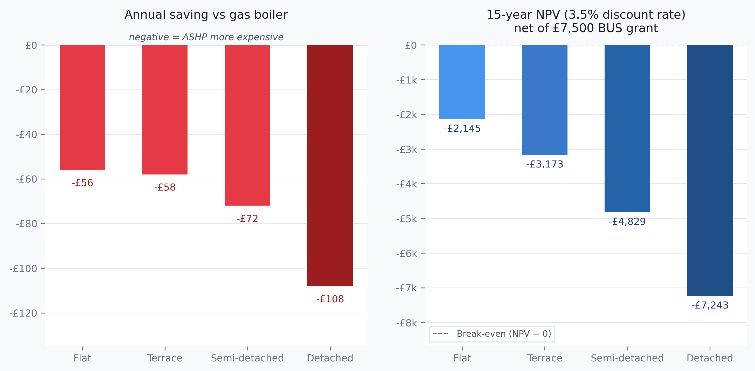
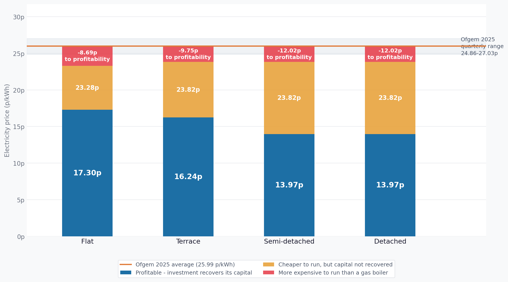
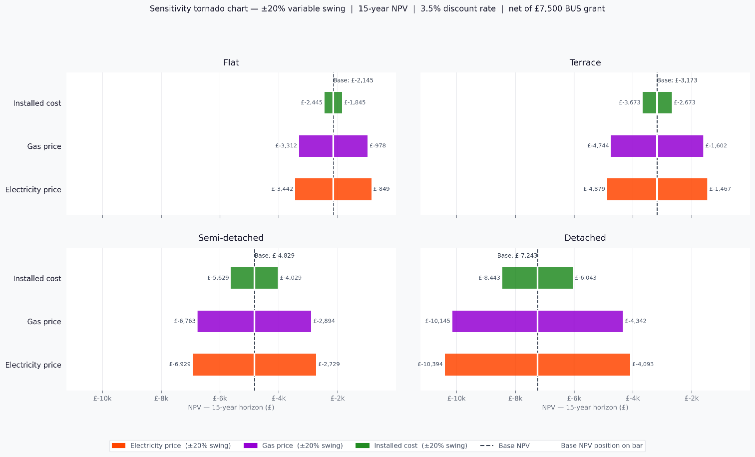
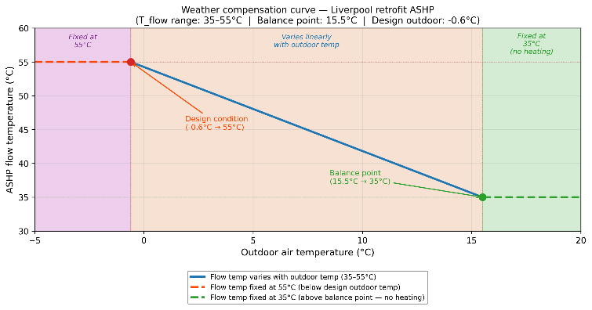
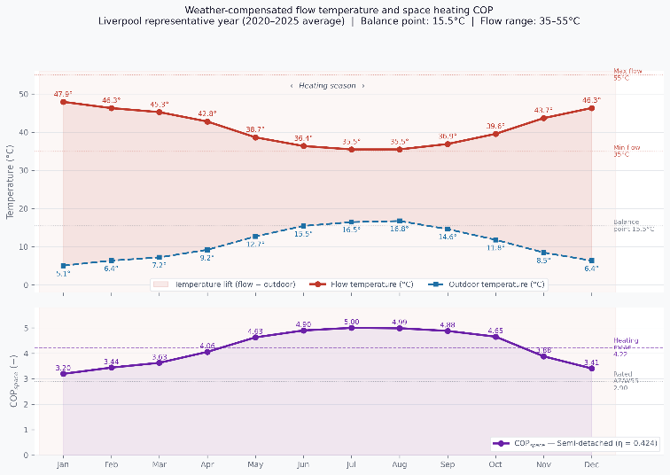

# Air Source Heat Pump Techno-Economic Assessment — Liverpool

An hourly simulation model assessing whether replacing gas boilers with air source
heat pumps (ASHPs) is economically viable across four Liverpool dwelling types under
2025 UK energy prices.

**Headline finding:** despite seasonal efficiencies of 3.23–3.30, ASHPs cost more to
run than gas boilers for every dwelling type. And running-cost parity is not the same
as profitability — the investment needs electricity roughly to halve before it
recovers its capital over 15 years.

---

## Why this project exists

Most published ASHP techno-economic analyses use static manufacturer COP figures and
national-average energy prices. Neither captures how a heat pump actually behaves
across a real heating season in a specific climate, or how the quarterly structure of
the Ofgem price cap interacts with strongly seasonal electricity demand.

This model addresses both by simulating every hour of a representative year using
five years of Liverpool weather observations, a Carnot-framework COP model calibrated
against EN 14511 manufacturer test data, and Ofgem standard variable tariff rates
applied quarter by quarter.

---

## Results

### Seasonal performance

| Dwelling | SCOP space | SCOP DHW | SCOP total | EoH SPFH2 benchmark | Model gap |
|---|---|---|---|---|---|
| Flat | 3.68 | 1.72 | 3.23 | 2.93 | +0.30 |
| Mid-terrace | 3.79 | 1.72 | 3.30 | 2.93 | +0.37 |
| Semi-detached | 3.79 | 1.72 | 3.30 | 2.93 | +0.37 |
| Detached | 3.79 | 1.72 | 3.30 | 2.93 | +0.37 |

The DHW figure of 1.72 reproduces the MCS 031 default SPF of 1.70 to within 1.2%,
confirming the calibration is correct. The space heating figures exceed the
Electrification of Heat field median because the Carnot framework excludes defrost
losses, part-load cycling, and auxiliary loads — a known and quantified bias.

### Financial outcome

| Dwelling | Annual saving | NPV 15 yr | Payback |
|---|---|---|---|
| Flat | −£56 | −£2,145 | none |
| Mid-terrace | −£58 | −£3,173 | none |
| Semi-detached | −£72 | −£4,829 | none |
| Detached | −£108 | −£7,243 | none |

All figures net of the £7,500 Boiler Upgrade Scheme grant, discounted at 3.5% real
(HM Treasury Green Book). Payback is undefined because annual savings are negative —
the investment never recovers from operational savings.



### Two thresholds, not one

This is the distinction the model is built to expose. Break-even electricity price is
commonly quoted as a single number, but it answers a running-cost question only — it
contains no capital term at all. The price at which a household actually profits is
substantially lower.

| Dwelling | Running-cost parity | Profitable (NPV = 0) | Cut required |
|---|---|---|---|
| Flat | 23.28 p/kWh | **17.30 p/kWh** | −33.4% |
| Mid-terrace | 23.82 p/kWh | **16.24 p/kWh** | −37.5% |
| Semi-detached | 23.82 p/kWh | **13.97 p/kWh** | −46.3% |
| Detached | 23.82 p/kWh | **13.97 p/kWh** | −46.3% |



All four Ofgem 2025 quarterly rates (24.86–27.03 p/kWh) sit above *both* thresholds.
Clearing running-cost parity would only stop the annual bleed; profitability needs
electricity to fall by a third to a half.

*Semi-detached and detached share the same profitability threshold because their net
capital to heat demand ratios are identical (0.3435).*

### What drives the outcome

Sensitivity analysis ranks the drivers unambiguously: electricity price dominates,
gas price is second, installed cost is a distant third. The practical implication is
uncomfortable for current policy — capital subsidy targets the weakest of the three
levers.



Achieving profitability through subsidy alone would require BUS grants of
£9,645–£14,744, an uplift of £2,145–£7,244 above the current £7,500. The uplift
required equals the NPV shortfall exactly — an identity the code asserts on every run.

---

## Method

Six stages, each implemented as a separate module:

**1 — Heat demand.** Published benchmarks for North West England, adjusted +1% for
Liverpool, split 88/12 between space heating and hot water per Phillips and Wilson (2024).

**2 — Weather.** Five years of hourly Open-Meteo observations for Liverpool
(2020–2025), averaged into a representative 8,760-hour year. Design temperature taken
as the 1st percentile of all hourly records (−0.6 °C), equivalent to the 99th
percentile exceedance criterion in MCS MIS 3005-D.

**3 — Flow temperature.** Linear weather compensation between two anchors: 55 °C flow
at the −0.6 °C design condition, 35 °C at the 15.5 °C balance point. The linear form
follows from combining the heat loss relationship in BS EN 12831-1 with approximately
linear radiator output across the operating range (CIBSE Guide A).



**4 — Dynamic COP.** Carnot framework per Staffell et al. (2012). The efficiency
factor eta is anchored to the manufacturer COP at the A7/W55 EN 14511 test condition
and applied across all hourly operating states:

```
eta_space   = COP_A7W55 / (328.15 / 48.0) = COP_A7W55 / 6.836
COP_space(t) = eta_space * T_flow,K(t) / (T_flow,K(t) - T_out,K(t))
```

Hot water uses a fixed 55 °C sink with eta calibrated to reproduce the MCS 031
seasonal performance factor of 1.70.



Flow temperature and COP move inversely: January flow peaks at 47.9 °C when outdoor
bottoms at 5.1 °C, and COP falls to 3.20. The heating-season mean of 4.06 sits well
above the rated 2.90 because most Liverpool heating hours are far milder than the
design condition.

**5 — Simulation.** Space heating demand distributed by degree-hour weighting, hot
water uniformly. Hourly electricity consumption costed at the Ofgem quarterly rate
applying to that hour.

**6 — Appraisal.** NPV across 10, 15 and 20-year horizons, simple payback, both
electricity-price thresholds, and ±20% tornado sensitivity on the three cost drivers.

---

## Running it

```bash
git clone https://github.com/alikhorshidian1373/ashp-liverpool-techno-economic.git
cd ashp-liverpool-techno-economic
pip install -r requirements.txt
python run_analysis.py
```

Weather data is fetched from the Open-Meteo API on first run and cached locally.
Figures are written to `figures/`, numerical results to `results/`.

To explore interactively:

```bash
jupyter notebook notebooks/analysis.ipynb
```

---

## Repository layout

```
src/
  config.py       Model constants, all traceable to a cited source
  weather.py      Open-Meteo retrieval, representative year construction
  demand.py       Heat demand and hourly distribution
  heatpump.py     Weather compensation and dynamic COP model
  economics.py    NPV, payback, both price thresholds
  sensitivity.py  Tornado analysis and grant requirement
  plotting.py     Figure generation, shared visual theme
notebooks/
  analysis.ipynb  Annotated walkthrough
docs/             Figures used in this README
run_analysis.py   Entry point — runs the full pipeline
```

Every constant in `config.py` carries a source comment. Nothing is a magic number.

---

## Validation

The model is checked against published field data rather than presented on its own
terms, and the code asserts its own internal consistency:

- Hot water SCOP of 1.72 against the MCS 031 target of 1.70 — agreement to 1.2%,
  the residual explained by Jensen's inequality in the convex Carnot relationship
- Total SCOP of 3.23–3.30 against the Electrification of Heat field median SPFH2 of
  2.93 — a +0.30 to +0.37 overestimate, consistent with the auxiliary loads the model
  omits
- Grant requirement against NPV shortfall — these must be equal by construction, and
  `verify_grant_identity()` asserts it on every run

The direction of the SCOP bias matters for the conclusions: real field performance
would produce larger running cost penalties than reported, so the economic case
against adoption is if anything stronger than the model indicates.

---

## Limitations

The Carnot framework assumes a constant fraction of theoretical maximum efficiency
across all operating conditions. It excludes defrost cycles, part-load modulation
penalties, and auxiliary pump and control loads. Heat demands derive from published
benchmarks and may overstate consumption for recently improved properties. Cooking
gas is excluded from the baseline on the grounds that heating system replacement does
not affect it.

---

## Sources

Model parameters trace to: BS EN 14511-2:2022 (test conditions), MCS MIS 3005-D:2025
(design standard), MCS 031 (DHW performance factor), DECC URN 14D/435
(heat demand benchmarks), CIBSE Guide A (design temperatures), HM Treasury Green Book
(discount rate), Ofgem quarterly price cap announcements (tariffs), and Open-Meteo
Historical Archive API (weather).

Key literature: Staffell et al. (2012) *Energy Environ. Sci.* for the COP framework;
Energy Systems Catapult (2024) Electrification of Heat for field validation; Barnes
and Bhagavathy (2020) *Energy Policy* and Rosenow et al. (2025) *iScience* for the
policy context.

---

## About

Built as the modelling component of an MSc Renewable Energy dissertation at Liverpool
John Moores University. The full written report is available on request.

Licensed under MIT — see `LICENSE`.
